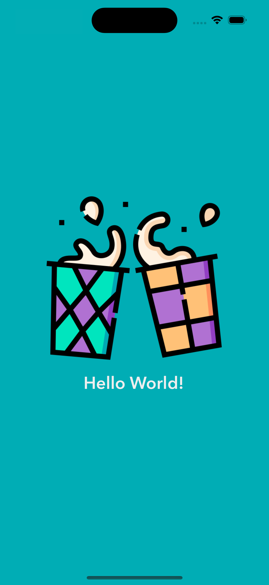

# Introduction to Storyboards and Interface

## Objectives

1. Understand the purpose of Storyboards and Interface
2. Understand how to use Storyboards and Interface
3. Understand how to use Main Storyboard to create hello world app
4. Understand how to use custom app icon

## Final Result

